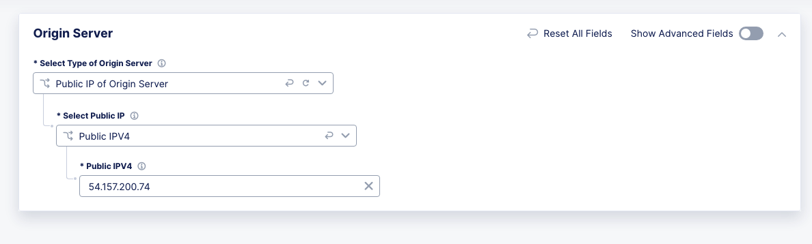
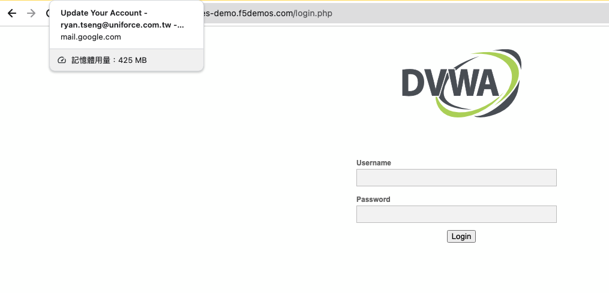

==================================================

.. contents:: Table of Contents

目標
####################
使用本指南和提供的示範應用程式和工具，探索 F5 Distributed Cloud (XC)的 Web 應用程式和 API 保護功能 (WAAP)。這將幫助您入門 WAAP 的幾個使用案例：

- Web 應用程式防火牆 (WAF)
- API 發現和保護
- 負載平衡器服務策略
- 機器人緩解
- DoS/DDoS 緩解
  
情境
####################
我們將以一個典型的客戶應用情境為例：一個星級評分應用程式。這個應用程式允許用戶對各種物品（例如電子商務產品或客戶服務）進行評分和評論。該應用程式運行在 Kubernetes 容器平台上，可以部署在各種雲端環境中。然而，為了本次演示指南的目的，我們將使用預先在 XC 虛擬 Kubernetes（vK8s）上部署的應用程式，並使用 XC WAAP 進行保護。

情境架構
#######################
F5 XC WAAP 是一套基於 SaaS 的安全服務，為分佈式應用程式服務提供全面的保護。在我們的情境中，應用程式服務部署在不同 XC vK8s 區域的多個 vK8s pod 上，由 F5 全球 PoP 提供服務，以表示分散的工作負載；同樣的模型適用於在任何雲端上進行類似部署。

這個實驗的目的是透過在 Docker 容器中部署一個典型的範例應用程式，再透過 XC 服務進行管理，以自給自足的方式快速熟悉 XC 平台。同時還包括一個單獨特制的"實用工具"服務，該服務提供生成模擬用戶流量和攻擊（如 WAF 或機器人）所需的工具，以幫助說明不同的 WAAP 使用情境。

*Docker 容器應用程式*: 包含了 Star Ratings 應用程式，由一個簡單的後端服務組成，該服務公開了一個 API，以及一個使用該 API 的前端。

*測試工具*: 基於 Web 的服務，包含了專門用於測試 **部署的示範應用程式** 狀態的腳本和工具。

**注意：此工具僅用於此WAAP演示指南，僅接受包含有效的 Star Ratings 示範應用程式部署的 URL，並且此部署必須托管在 F5 Distributed Cloud 上（主機名以'.ac.vh.ves.io'結尾）。此工具無法用於在此演示指南以外的任何其他網站/網頁應用程式上運行測試。**

在這個指南的範圍內，測試工具可用於啟動/停止 WAF 測試、機器人測試，以及檢查 WAAP / Bot Defense 的保護狀態。

.. figure:: assets/waap_overview.png

登入 F5 Distributed Cloud 控制台
##########################################
1. 一旦您啟動了 UDF 部署，就會觸發一個工作流程，為您在 f5-sales-demo 租戶中創建一個用戶帳戶。您應該已經收到一封電子郵件，要求您設定此帳戶的密碼。按照電子郵件中的說明設置您帳戶的密碼。

2. 如果系統要求您輸入 XC 租戶域名，請輸入f5-sales-demo並點擊 **Next** 。

.. figure:: assets/xc-domain.png
   :width: 600px

3. 使用您的電子郵件和剛剛設定的密碼登入：

.. figure:: assets/xc-login.png
   :width: 600px

4. 如果系統要求，請查看並接受 **Terms of Service** 和 **Privacy Policy** 。

5. 當要求您識別自己時，選中所有核取方塊，然後點擊 **Next** 。

6. 點擊 **Advanced** ，然後點擊 **Get Started** 。

7. 一旦您成功登入租戶，導航到 **Multi-Cloud App Connect** 。

8. 在 URL 中，您將找到為您隨機生成的 Namespace：

.. figure:: assets/xc-namespace.png
   :width: 800px

9. 記下上述 Namespace，因為您將在隨後的步驟中需要它。

設置 HTTP 負載平衡器
******************************

接下來，我們需要通過配置我們應用程式的 HTTP 負載平衡設置，使我們的示範應用程式工作負載可訪問。我們將為服務創建一個源池。源池包括端點、叢集、路由和宣告策略，這些都是發布應用程式至網際網路所需的元素。

返回到 F5 Distributed Cloud 控制台，導航到服務選單中的 **Multi-Cloud App Connect** 服務。

.. figure:: assets/load_balancer_navigate.png
   :width: 600px

選擇 **HTTP Load Balancers**。

.. figure:: assets/load_balancer_navigate_menu.png
   :width: 500px

點擊 **Add HTTP Load Balancer** 按鈕以打開 HTTP 負載平衡器創建表單。

.. figure:: assets/load_balancer_create_click.png
   :width: 600px

接著輸入負載平衡器的名稱。

.. figure:: assets/httplb_set_name.png

接下來，我們需要為我們的工作負載提供一個域名：域名可以委派給 F5，以便可以快速創建域名服務（DNS）紀錄，加速部署和路由流量到我們的工作負載。在這個演示中，我們指定 **star-ratings-(您的學生編號).sales-demo.f5demos.com** 。

委派的域名已事先設定好，您可以直接使用 **Automatically Manage DNS Records** 。

.. figure:: assets/httplb_set_domain.png

之後，讓我們創建一個新的源池，它將用於我們的負載平衡器。源池是將一組端點配置為一個資源池，該資源池用於負載平衡器配置。點擊 **Add Item** 以打開源池創建表單。

.. figure:: assets/httplb_pool_add.png

然後打開下拉選單，點擊 **Add Item** 。

.. figure:: assets/httplb_pool_add_create.png

首先，讓我們給這個池一個名稱。

.. figure:: assets/httplb_pool_name.png

現在點擊 **Add Item** 以開始新增一個源站伺服器

.. figure:: assets/httplb_pool_origin_add.png

現在讓我們配置源伺服器。首先打開下拉選單，指定源伺服器的類型。對於這個 LAB，請選擇 **Public IP of Origin Server**。
然後，指定源站 IP 名稱 **54.157.200.74** (已提前部建好的應用服務)。
完成後，點擊 **Apply** 。

接下來，我們需要配置源站服務監聽的埠號。在這個 LAB 中，請使用 8080 埠。

.. figure:: assets/httplb_pool_port.png

然後只需點擊 **Continue** 以繼續。

.. figure:: assets/httplb_pool_continue.png

完成後，點擊 **Apply** 以將源池應用於負載平衡器配置。這將返回到負載平衡器配置表單。

.. figure:: assets/httplb_pool_confirm.png

查看負載平衡器配置，然後點擊 **Save and Exit** 以完成創建。

.. figure:: assets/httplb_save_and_exit.png

為了生成流量並對我們的應用程式進行攻擊，我們需要一個可以透過網際網路存取服務的 FQDN 或是 IP。對於本指南的目的，您可以使用如下圖所示的生成的 CNAME 值。

.. figure:: assets/httplb_cname.png

現在讓我們打開網站來檢查它是否正常運作。您可以使用 CNAME 或您的域名來執行此操作。

太好了，您的示範應用程式已經上線，您現在應該已經準備好進行 WAAP 使用案例的操作了。

WAAP Use-Case Demos
####################

在此階段，無論您是選擇在*路徑1*中使用手動方式，或在*路徑2*中使用Ansible自動化，您應該都已經有一個運作中的範例應用程式。您現在可以開始執行WAAP的使用案例。再次提醒，您可以選擇手動跟隨以下步驟進行這些使用案例，或者選擇在Ansible指南中使用對應的部分來自動執行手動完成的步驋。

應用程式保護
**************

熟練的攻擊者將使用自動化和多種工具來探索各種攻擊向量。從導致網站被篡改的簡單跨站腳本攻擊（XSS）到更複雜的零日漏洞，攻擊範圍持續擴大，並且並非所有攻擊都有對應的簽名！

F5分散式雲端WAF內置的簽名、威脅情報、行為分析和機器學習能力的結合，使其能夠檢測已知攻擊並緩解來自可能惡意用戶的新興威脅。這為跨雲端和架構提供的應用程式提供了有效且易於操作的安全性。

在**應用程式保護**使用案例中，我們將看到如何使用F5的分散式雲端來創建有效的WAF政策，快速保護我們的應用程式前端。我們已經有了我們範例應用程式的用戶流量，這些流量透過F5分散式雲端內的HTTP負載平衡器流動，將請求路由到在Amazon AWS中運行的應用程式實例。為了保護這些流量，我們將編輯我們早先創建的HTTP負載平衡器，並配置App Firewall。

首先，讓我們測試我們的應用程式，看看它是否容易受到攻擊。為此，我們將使用測試工具，該工具根據其CNAME向應用程式發送攻擊。

請按照以下連結 `<https://test-tool.sr.f5-cloud-demo.com>`_，然後粘貼一步之前複製的CNAME，並點擊 **發送攻擊**。在它下面的框中，你將看到攻擊類型和站點狀態--我們的應用程式對它們是脆弱的。現在讓我們開始保護應用程式，創建和配置防火牆。然後我們將再次測試應用程式，以查看保護的結果。

.. figure:: assets/test_waf_1.png

回到F5分散式雲端控制台，打開服務菜單並導航到**Web應用程式和API保護**。

.. figure:: assets/waf_navigate.png
   :width: 600px

然後前往**HTTP負載平衡器**部分。

.. figure:: assets/waf_navigate_menu.png
   :width: 500px

打開HTTP負載平衡器屬性並選擇**管理配置**。

.. figure:: assets/httplb_popup.png
   :width: 850px

在右上角點擊**編輯配置**以開始編輯HTTP負載平衡器。

.. figure:: assets/httplb_edit.png

在**Web應用程式防火牆**部分，首先在下拉菜單中啟用**App防火牆**，然後點擊**新增項目**以配置新的WAF對象。

.. figure:: assets/waf_create.png

首先，為防火牆取一個名稱。

.. figure:: assets/waf_name.png

然後在下拉菜單中指定強制模式。預設為**監控**，這意味著分散式雲端WAF服務不會阻擋任何流量，但會對任何被發現違反WAF政策的請求進行警告。**阻擋**模式意味著分散式雲端WAF將對觸犯的流量採取緩解行動。選擇**阻擋**模式選項。

.. figure:: assets/waf_enforcement_mode.png

接下來，我們將指定檢測設置。預設設置被推薦用於減輕惡意流量，並具有低假陽性率。但我們將選擇**自訂**檢測設置，以覆蓋和自訂預設的政策檢測預設值。

.. figure:: assets/waf_detection_custom.png

在下拉菜單中選擇**自訂**攻擊類型，然後進行指定**已禁用的攻擊類型**。選擇**命令執行**攻擊類型。命令執行是針對Web應用程式的攻擊，目標是操作系統命令以獲取對其的訪問。

.. figure:: assets/waf_attack_types.png

下一個屬性**按準確性選擇簽名**允許我們禁用一些攻擊類型並使用不同的簽名集合以獲得最佳準確性。對於這個演示，讓我們啟用**高，中和低**準確性的簽名。

.. figure:: assets/waf_signature.png

之後我們將編輯已禁用違規的列表。這可以檢測到各種類型的違規，如格式錯誤的數據和非法文件類型。對於這個使用案例，我們將選擇**自訂**違規，然後指定**錯誤的HTTP版本**。

.. figure:: assets/waf_violatations.png

接下來我們將指定阻擋響應頁面。要做到這一點，選擇**自訂**並指定**403 Forbidden**作為響應碼。預設情況下，分散式雲端WAF會尋找特定的查詢參數，如"卡"或"密碼"，以防止可能的敏感信息，如帳戶憑證或信用卡號碼出現在安全日誌中。這可以通過一個可以包含ASCII或base64的自訂體的阻擋響應頁面來自訂。

.. figure:: assets/waf_adv_config.png

現在我們已經完成所有設置，只需點擊繼續。

.. figure:: assets/waf_continue.png

點擊儲存並退出以儲存HTTP負載平衡器設置。

.. figure:: assets/waf_save_lb.png

現在我們已經準備好測試並查看我們的應用程式是否仍然容易受到攻擊。按照此鏈接 <https://test-tool.sr.f5-cloud-demo.com>_，並點擊發送攻擊。在其下方的框中，您將看到攻擊類型及其狀態 - 它們現在都被阻擋，我們的應用程式是安全的。

.. figure:: assets/test_waf_2.png

接下來，讓我們看看F5分散式雲端WAAP提供的一些可見性和安全洞察。導航到儀表板，選擇安全儀表板，然後點擊我們的負載平衡器。

.. figure:: assets/waf_dashboard_navigate.png

在這裡，我們將看到應用程式儀表板。該儀表板提供了所有安全事件的詳細信息，包括位置，政策規則命中，惡意用戶，主要攻擊類型以及通過F5分散式雲端WAAP相關洞察收集的其他關鍵信息。

.. figure:: assets/waf_dashboard_events.png

現在導航到安全事件，然後打開其中一個安全事件以深入了解。

.. figure:: assets/waf_requests.png

讓我們看看Java代碼注入攻擊的具體情況。在這裡，我們不僅可以看到其時間，起源和源IP，還可以深入查看非常詳細的信息。

.. figure:: assets/waf_request_details.png

在查看攻擊之後，可以阻止客戶端。要做到這一點，打開菜單並選擇添加到被阻擋的客戶端。

.. figure:: assets/waf_block_options.png

F5分散式雲端WAF也通過惡意用戶檢測提供安全性。惡意用戶檢測有助於識別和排名可疑（或可能惡意）的用戶。安全團隊經常被警報疲勞、長時間的調查、錯過的攻擊以及假陽性所困擾。通過惡意用戶檢測的回溯性安全允許安全團隊過濾噪音並通過可操作的情報識別實際風險和威脅，無需手動干預。

WAF規則命中，禁止訪問嘗試，登錄失敗，請求和錯誤率 -- 都創建了一個事件時間線，這可能表明存在惡意活動。表現出可疑行為的用戶可以被自動阻擋，並且可以通過允許列表進行例外處理。

下面的屏幕截圖表示惡意用戶可能的外觀。

.. figure:: assets/waf_malicious_user.png

API Protection 
**************

Protecting API resources is a critical piece of a holistic application security strategy. API Security helps us analyze and baseline normal levels of traffic, response rates, sizes and data being shared via APIs. 

Without API protection all traffic goes directly to the server and can be harmful. Let's take a look at an attack on our sample app and then protect its API.

Go back to the Test Tool  `<https://test-tool.sr.f5-cloud-demo.com>`_, and switch to the **API Security in Action** tab. Then click **SEND ATTACKS**. In the box under it you will see the status which shows that API is vulnerable. Now let's go ahead and protect API.

.. figure:: assets/test_api_1.png

Distributed Cloud API Security helps protect API resources based on an Open API specification, typically captured in a Swagger file. The API Security service supports the upload of an Open API specification file, which contains API routes that can be protected by the Web App Firewall, as well as methods that can be enabled and disabled. 

To start API protection configuration, go back to the F5 Distributed Cloud Console, select **Swagger Files** and click **Add Swagger File**. 

.. figure:: assets/swagger_navigate.png

Give swagger file a name and then upload it. Once it's uploaded, click **Save and Exit**.
   
.. figure:: assets/swagger_upload_file.png

Now over to creating API Definition. Navigate to **API Definition** and then click the **Add API Definition** button.

.. figure:: assets/api_definition_navigate.png

Enter a name in the metadata section. Then go to **Swagger Specs** section and open the drop-down menu. Select the swagger spec added earlier, then click **Save and Exit** to create API definition object.

.. figure:: assets/api_definition_create.png

Now we need to attach the created API definition to our HTTP load balancer. Navigate to **Load Balancers** and select **HTTP Load Balancers**. The HTTP Load Balancer we created earlier will appear. Open its menu and select **Manage Configuration**.

.. figure:: assets/api_definition_lb_popup.png

Click **Edit Configuration** to start editing.

.. figure:: assets/api_definition_lb_edit.png

In the **API Protection** section enable **API Definition** and then select the API Definition created earlier. 

.. figure:: assets/api_definition_select_api_def.png

Now we need to a create a new Service Policy with a set of Custom Rules that will specify either an Allow or Deny rule action for specific API resources contained in our Swagger file. This approach uses the combination of Service Policies and Custom Rules to fine-tune and provide granular control over how our application API resources are protected.

Scroll to the **Common Security Controls** section and select **Apply Specified Service Policies**. Then click **Configure**. 

.. figure:: assets/api_definition_policy.png

Click on the **Select Item** field and select **Add Item** option.

.. figure:: assets/api_definition_policy_create.png

Enter a name for the policy in the metadata section and go to the **Rules** section. Select **Custom Rule List** and click **Configure**.

.. figure:: assets/api_definition_policy_create_rules.png

Let's now add rules: click **Add Item**.
   
.. figure:: assets/api_definition_rule_add.png

The first rule will deny all except the API. Enter a name in the metadata section and scroll down. 

.. figure:: assets/api_definition_rule_add_details.png

Next configure HTTP Path. Click **Configure** in the **HTTP Path** section.

.. figure:: assets/api_definition_rules_path.png

And fill in the path - **/api/v1/** for this demo. Then click **Apply**.

.. figure:: assets/api_definition_rules_prefix.png

Scroll down to **Advanced Match** section and click **Configure** for the API Group Matcher field.

.. figure:: assets/api_definition_rules_api_matcher.png

In the API Group Matcher screen, select an exact value. 

.. figure:: assets/api_definition_rules_matcher_select_api_def.png

Tick the **Invert String Matcher** option and click **Apply** to add the matcher. 

.. figure:: assets/api_definition_matcher_tick.png

 Click another **Apply** to add the rule specification. 

.. figure:: assets/api_definition_policy_apply.png

Click **Apply** to add the rule.

.. figure:: assets/api_definition_add_rule.png

Create one more rule to 'allow-other' using the **Add Item** option in the rules section. 

.. figure:: assets/api_definition_second_rule.png

First, enter a name in the metadata section.
   
.. figure:: assets/api_definition_second_rule_details.png

Next, select **Allow** for Action field in the Action section.

.. figure:: assets/api_definition_second_rule_allow.png

Click **Apply** to add the rule specification.

.. figure:: assets/api_definition_second_rule_apply.png

Click **Apply** to add the second rule.

.. figure:: assets/api_definition_second_rule_add.png

Take a look at the rules created and click **Apply**. 

.. figure:: assets/api_definition_rule_list_apply.png

Click **Continue** to add the service policy to the load balancer and then **Apply**.

.. figure:: assets/api_definition_continue.png

.. figure:: assets/api_definition_def_policy_apply.png

The last step is to look the configuration through and save the edited HTTP load balancer. Once you click **Save and Exit** at the end, the Load Balancer will update with the API security settings and our API resources will be protected!

.. figure:: assets/api_definition_lb_save.png

Well done! The API of our sample Rating App is protected based on the spec in the uploaded Swagger file. Let's try and see that the access is forbidden.

Go back to the Test Tool  `<https://test-tool.sr.f5-cloud-demo.com>`_, and click **SEND ATTACKS**. In the box under it we will see **protected** status, so our API is safe now.  

.. figure:: assets/test_api_2.png

In cases where API specifications are not known or well documented, the F5 Distributed Cloud API Security provides a machine learning (ML)-based, dynamic API Discovery service.

API Discovery analyzes traffic that flows to and from API endpoints and constructs a visual graph to detail API path relationships. It may be difficult for an organization to keep track of APIs, as they typically change frequently. Over time F5 Distributed Cloud can baseline normal API behavior, usage, and methods, detecting anomalies and helping organization detect shadow APIs that bring unintended risk.

In the screenshot below we can see the percent of requests, learned schema for a specific endpoint, and even download an automatically-generated Swagger file based on discovered APIs.

.. figure:: assets/api_auto_discovery.png 

Bot Protection
**************

F5 Distributed Cloud Bot Defense helps us identify attacks and allow us then to easily block them! Our sample rating app could definitely benefit from Distributed Cloud Bot Defense. So let’s see how easy it actually is to set up and use the service!

First let's generate some bot traffic to our app. Go back to the Test Tool  `<https://test-tool.sr.f5-cloud-demo.com>`_, and switch to the **Bot Defense in Action** tab. Click **GENERATE BOT TRAFFIC**. In the box under it we will see that all the bot traffic passed. Now let's go ahead and block it by setting up a resilient anti-automation solution that will be attached to the HTTP Load Balancer that processes the traffic to our app. We will then test it to see how Bot Protection works.

.. figure:: assets/test_bot_1.png

Navigate to **HTTP Load Balancers**, open the menu of the load balancer we created earlier and select **Manage Configuration**.

.. figure:: assets/bot_lb_popup.png

Click **Edit Configuration** to start editing the load balancer.

.. figure:: assets/bot_lb_edit.png

Go to the **Bot Protection** section and enable Bot Defense. The Regional Endpoint is **US** due to its closer proximity to our sample app user base. Click **Configure** to configure Bot Defense Policy.

.. figure:: assets/bot_config.png

Next, we need to configure an App Endpoint, which will contain the policies and actions to protect the specific resource in our app that’s used for adding ratings. To do that click **Configure**.

.. figure:: assets/bot_config_endpoint.png

Click **Add Item** to start adding an endpoint.

.. figure:: assets/bot_config_endpoint_add.png

Name the endpoint and then select HTTP Methods. Let's pick **PUT** and **POST** for this demo. Scroll down and fill in the path - **/api/v1/**.
Then set Bot Traffic Mitigation options to **Block** action for identified bot traffic, and select **403 Forbidden** status. 
Go ahead and click **Apply** to complete the App Endpoint setup.

.. figure:: assets/bot_full_config.png

We’ve just defined the policy to protect our vulnerable Rating app resource with Bot Defense enabled. Now, click **Apply** to confirm.

.. figure:: assets/bot_endpoint_apply.png

Click **Apply** to apply the configured Bot Defense Policy.

.. figure:: assets/bot_config_apply.png

To complete the configuration of load balancer, click **Save and Exit**.

.. figure:: assets/bot_lb_save.png

Now we can test and see the end-result of our setup. Go back to the Test Tool  `<https://test-tool.sr.f5-cloud-demo.com>`_, and click **GENERATE BOT TRAFFIC**. This time we will see **blocked** status.  

.. figure:: assets/test_bot_2.png

Now let’s have a look at the Security analytics for the HTTP Load Balancer where we configured Bot Defense. Navigate to **Dashboards**, then **Security Dashboard** and click on the load balancer name.

.. figure:: assets/bot_dashboard_0.png

Navigate to the **Bot Defense** tab. Here we will see key info breaking down: which bots are making the most malicious requests, which endpoints are attacked the most, and which automation types are being used the most. 

.. figure:: assets/bot_dashboard_1.png

Then move on to the **Security Events** tab. Here we can go into detail on the HTTP Load Balancer traffic from the point of view of Bot traffic analytics. From transactions per minute for a specified timeframe, to detail of every HTTP request with inference of whether it is a legitimate user or automation traffic.

.. figure:: assets/bot_dashboard_2.png

DDoS Protection
***************

F5 Distributed Cloud WAAP is monitoring traffic and is able to identify multiple types of security events, including DDoS attacks directed towards our application as DDoS Security Events. This provides critical intelligence of your app security at your fingertips.

In this demo we will configure DDoS protection by specifying IP Reputation and rate limiting for the sample app. Then we will add DDoS mitigation rule to block users by IP source defining expiration timestamp. 

Navigate to **HTTP Load Balancers**, open the menu of the load balancer we created earlier and select **Manage Configuration**. 

.. figure:: assets/ddos_lb_popup.png

Click **Edit Configuration** to start editing the load balancer.

.. figure:: assets/ddos_lb_edit.png

In the **Common Security Controls** section enable **IP Reputation** and choose IP threat categories. We select **Spam Sources, Denial of service, Anonymous Proxies, Tor Proxy** and **Botnets** for this demo.

.. figure:: assets/ddos_ip_reputation.png

In order to configure rate limiting, select **Custom Rate Limiting Parameters** in the drop-down menu of rate limiting and click **View Configuration**.

.. figure:: assets/ddos_rate_limiting_select.png

First specify number, then burst multiplier. For this use-case we specify **10** and **5** respectively. Click **Apply** to proceed. 

.. figure:: assets/ddos_rate_limit_config.png

In the **DoS Protection** section enable DDoS detection in the drop-down menu and click **Configure** to add a new rule.

.. figure:: assets/ddos_detection.png

Next click the **Add Item** button to open the form where we will create an ‘IP Source’ mitigation rule.

.. figure:: assets/ddos_mitigation_add.png

Give rule a name, specify IP we want to block - **203.0.113.0/24** and indicate the expiration time stamp. Finally, click the **Apply** which will create our DDoS Mitigation rule.

.. figure:: assets/ddos_mitigation_rule.png

Click **Apply** to apply the rule we've created.

.. figure:: assets/ddos_mitigation_rule_apply.png

And finally we need to click **Save and Exit** to save these changes and allow the F5 Distributed Cloud WAF engine to start enforcing our newly created DDoS Mitigation rule and blocking the malicious IP.

.. figure:: assets/ddos_save_lb.png

See how easy that was! This should definitely help with the performance and uptime of our application!

We have created the service policy to block that malicious IP. Now let’s have a look at the reporting and analytics for the HTTP Load Balancer where we configured the policy for our app. 

Here we can see all of our app's critical security info in one place. Take a look at the **Security Events** section in the screenshot below showing all the events including the DDoS ones. Notice in the **DDoS Security Events** section we now see blocked traffic from the IP address we specified earlier. We can also see the map of security events giving clear visual security event distribution.

.. figure:: assets/ddos_demo_1.png

In the screenshot below you can see the analytics for our simulated traffic and attacks. See the impact of attacks on each endpoint by hovering over an endpoint on the map. We can also get insights into Top IPs, Regions, ASNs and TLS FPs. 

.. figure:: assets/ddos_demo_2.png

Wrap-Up
#######

At this stage you should have set up a sample app and sent traffic to it. You've configured and applied F5 Distributed Cloud WAAP services in order to protect both the Web & API of the app from malicious actors & bots. We also looked at the telemetry and insights from the data in the various Dashboards & security events.

We hope you have a better understanding of the F5 Distributed Cloud WAAP services and are now ready to implement it for your own organization. Should you have any issues or questions, please feel free to raise them via GitHub. Thank you!
